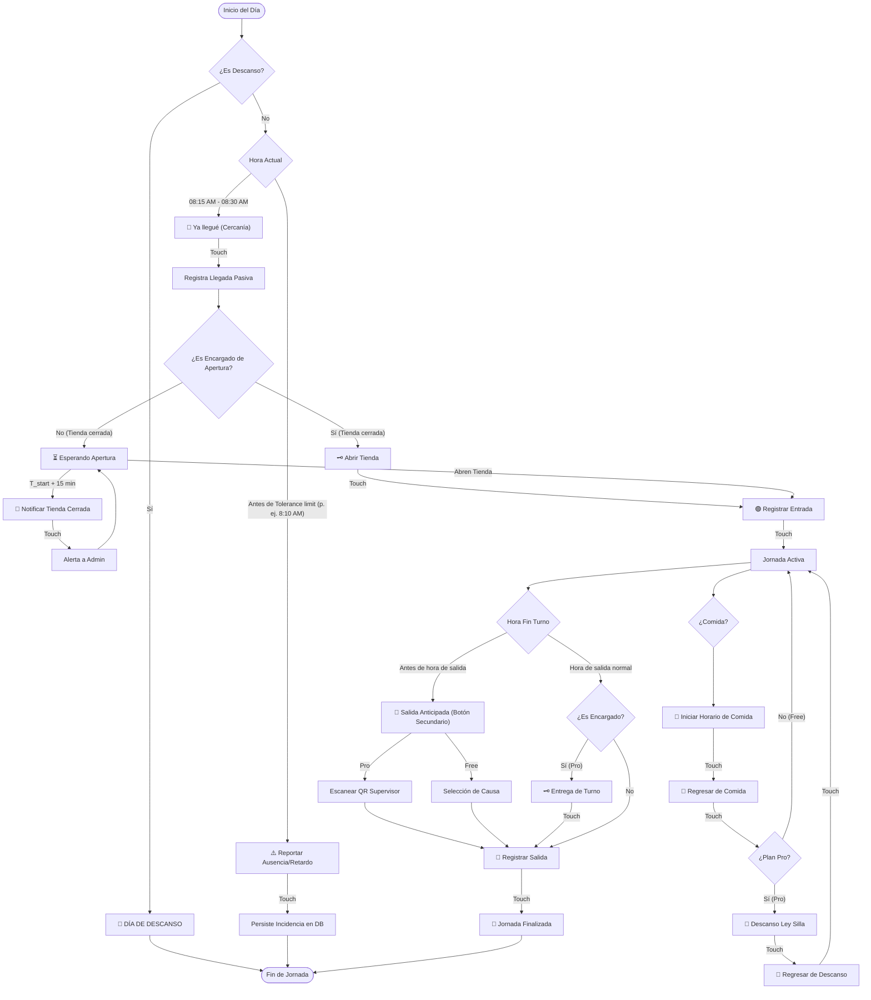

# Plan de Visualización y Flujo Cronológico del Dialer (Reloj Checador)

Este documento detalla la estructura lógica, el catálogo visual de botones, la persistencia en base de datos y la secuencia cronológica que sigue el **Botón Dialer** del Reloj Checador, tanto para la versión **Gratuita (Basic)** como para la versión **Profesional (Pro)**.

---

## 1. Secuencia Cronológica de una Jornada Laboral (Flujo de Estados)

El siguiente diagrama de flujo ilustra el recorrido cronológico de un colaborador durante un día de trabajo típico, indicando las transiciones del Dialer:

---

## 2. Catálogo Visual de Estados del Dialer

A continuación se muestra cómo se renderiza el botón en cada etapa cronológica de la jornada laboral, detallando su diseño, textos y comportamiento:

| Estado / Evento | Vista Gráfica (Botón del Dialer) | Comportamiento del Touch (Acción) | Datos Guardados en DB | Consecución (Siguiente Botón) |
| :--- | :--- | :--- | :--- | :--- |
| **1. Día de Descanso** | 
🌴Día de descansoNo laborable
 | **Deshabilitado**. Bloquea cualquier registro. | Ninguno. | Permanece inactivo todo el día. |
| **2. Reportar Incidencia** (Ausencia/Retardo) | 
⚠️Ausencia/RetardoTolerancia pre-turno
 | Abre formulario para seleccionar causa (ej. Tránsito, Enfermedad) y notificar al supervisor. | Tabla `audit_logs` con tipo `absence_reported` o `delay_reported`. | **Ausencia Registrada** o habilita entrada normal. |
| **3. Cercanía / Ya estoy aquí** (Ya estoy en la zona) | 
📍Ya lleguéAsegurar puntualidad
 | Registra presencia puntual pasiva en la sucursal antes del inicio físico del turno. | Log local pasivo y tabla `time_entries` tipo `proximity_check`. | **Abrir Tienda** (si es encargado) o **Esperando Apertura**. |
| **4. Esperando Apertura** | 
⏳Esperando AperturaPor encargado
 | **Deshabilitado**. Muestra el nombre de quién tiene las llaves. | Ninguno. | Cambia a **Registrar Entrada** en cuanto el encargado abra. |
| **5. Reportar Tienda Cerrada** | 
🚨Tienda CerradaNotificar al Admin
 | Envía alerta de que no han abierto la sucursal y la jornada ya inició. | Alerta guardada en `internal_messages` y amnistía automática. | **Esperando Apertura** (bloqueado para evitar spam). |
| **6. Abrir Tienda** | 
🗝️Abrir TiendaApertura física
 | Abre lista de verificación de apertura de tienda y pase de lista de sucursal. | Cambia estado de sucursal a `open` en `store_logs` y `time_entries`. | **Registrar Entrada** (para comenzar turno). |
| **7. Registrar Entrada** | 
🟢Registrar EntradaIniciar turno
 | Registra el inicio oficial de la jornada laboral en el sistema. | Tabla `time_entries` tipo `check_in` con marca de tiempo. | **Iniciar Horario de Comida** (Jornada Activa). |
| **8. Iniciar Comida** | 
🍔Iniciar ComidaSalida a almuerzo
 | Envía al colaborador a descanso de comida. | Tabla `time_entries` tipo `meal_start`. | **Regresar de Comida** (Estado: Comida). |
| **9. Regresar de Comida** | 
🏃Regresar de comidaFin de comida
 | Registra el reingreso a labores físicas en piso. | Tabla `time_entries` tipo `meal_end`. | **Descanso Ley Silla** (en Pro) o **Registrar Salida**. |
| **10. Descanso Ley Silla** | 
🧘Descanso Ley SillaDescanso de pie
 | Habilita el periodo de descanso corto obligatorio por Ley Silla. | Tabla `time_entries` tipo `break_start`. | **Regresar de Descanso** (Estado: Descanso). |
| **11. Regresar de Descanso** | 
🏃Regresar de descansoRetornar a puesto
 | Registra el fin del descanso y retorno al puesto. | Tabla `time_entries` tipo `break_end`. | **Registrar Salida** / **Entrega de Turno**. |
| **12. Entrega de Turno** | 
🗝️Entrega de TurnoTransferir llaves
 | Abre menú para delegar llaves de sucursal al encargado suplente de mañana. | Tabla `key_transfers` y bitácora de entrega. | **Registrar Salida**. |
| **13. Registrar Salida** | 
🚪Registrar SalidaTerminar jornada
 | Finaliza el turno y cierra labores. Valida tareas pendientes y evaluación de clima. | Tabla `time_entries` tipo `check_out`. | **Jornada Finalizada**. |
| **14. Jornada Finalizada** | 
🏁Jornada FinalizadaTurno concluido
 | **Deshabilitado**. Bloquea cualquier marcaje adicional. | Ninguno. | Permanece inactivo hasta el próximo turno. |

---

## 3. Ejemplo Práctico de Jornada Laboral Completa (Conexión de Eventos)

A continuación se detalla cómo avanza un colaborador a través de esta secuencia en un día laboral normal de **8:30 AM a 5:30 PM**:

### Paso 1: Amanecer y Trayecto (07:00 AM)
*   **Situación**: El colaborador va de camino a la sucursal.
*   **Estado Dialer**: `⚠️ Reportar Ausencia/Retardo`. Si surge una eventualidad, tiene hasta las **08:10 AM** (20 minutos antes del turno) para notificar desde la app. Si es el encargado, la hora límite se recorre automáticamente a las **07:45 AM** (45 minutos de traslado).

### Paso 2: Llegada a la Geocerca (08:20 AM)
*   **Situación**: Entra en el rango de GPS de la tienda.
*   **Estado Dialer**: Cambia a `📍 Ya estoy aquí`. Al oprimirlo, se registra su presencia pasiva ("espera en puerta") en base de datos.
*   **Efecto**: Si el encargado llega tarde a abrir la tienda física, el colaborador no es penalizado con retardo porque su llegada puntual ya quedó guardada.

### Paso 3: Apertura de Sucursal (08:25 AM)
*   **Situación**: El encargado con llaves llega a la sucursal.
*   **Estado Dialer**:
    *   *Encargado*: Ve el botón `🗝️ Abrir Tienda`. Al presionarlo, completa el stepper de checklists y abre la tienda físicamente.
    *   *Colaborador común*: Muestra `⏳ Esperando Apertura` de forma bloqueada hasta que el encargado confirme la apertura.

### Paso 4: Marcaje de Entrada Oficial (08:30 AM)
*   **Situación**: Tienda abierta y hora de inicio de turno.
*   **Estado Dialer**: Cambia a `🟢 Registrar Entrada`.
*   **Acción**: Al oprimirlo, guarda el check-in oficial en base de datos.

### Paso 5: Almuerzo / Comida (01:00 PM)
*   **Situación**: Es hora de comer.
*   **Estado Dialer**: `🍔 Iniciar Horario de Comida`.
*   **Acción**: Guarda `meal_start` en base de datos y cambia el estado visual a `🏃 Regresar de Comida`. Tras comer, oprime este último para marcar el retorno (`meal_end`).

### Paso 6: Descanso Ley Silla (03:30 PM)
*   **Situación**: El colaborador necesita descansar las piernas (Disponible en Pro).
*   **Estado Dialer**: Muestra `🧘 Descanso Ley Silla`.
*   **Acción**: Al oprimirlo, inicia el descanso de Ley Silla (`break_start`) y luego oprime `🏃 Regresar de Descanso` (`break_end`) para volver al trabajo.

### Paso 7: Cierre y Entrega de Turno (05:25 PM)
*   **Situación**: Se acerca la hora de salida (5:30 PM).
*   **Estado Dialer**:
    *   *Encargado*: Muestra `🗝️ Entrega de Turno` para delegar las llaves de la sucursal a través de la app al responsable del día siguiente.
    *   *Colaborador común*: Cambia directamente a `🚪 Registrar Salida`.

### Paso 8: Salida Oficial (05:30 PM)
*   **Estado Dialer**: `🚪 Registrar Salida`.
*   **Acción**: Al oprimirlo, se ejecuta el check-out oficial y el dialer se apaga mostrando `🏁 Jornada Finalizada`.
